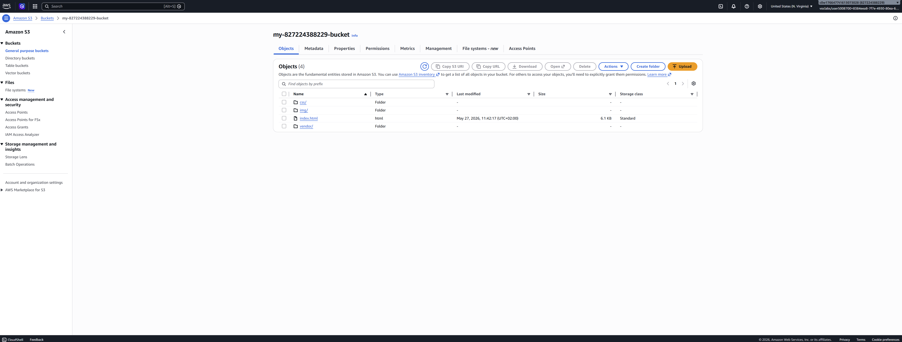
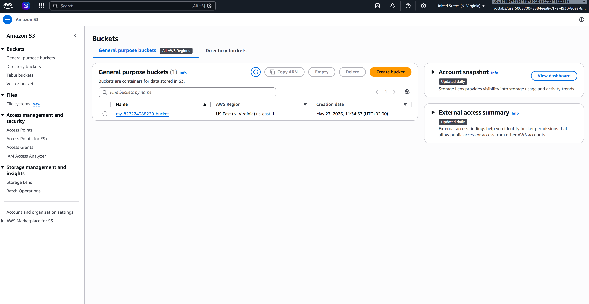
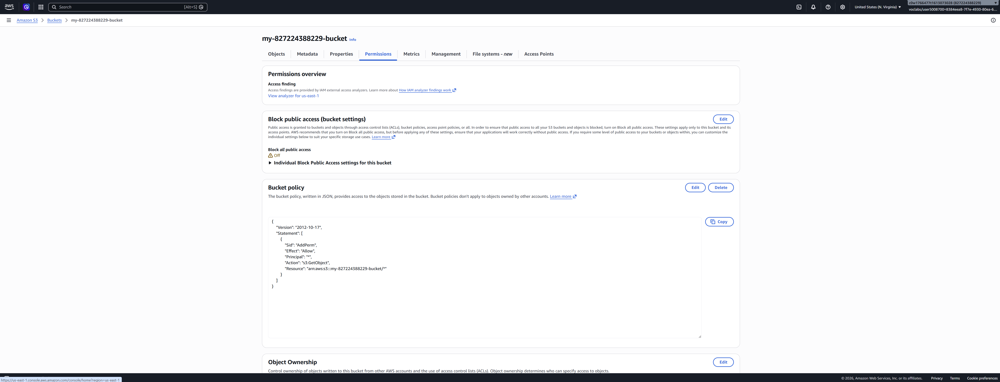
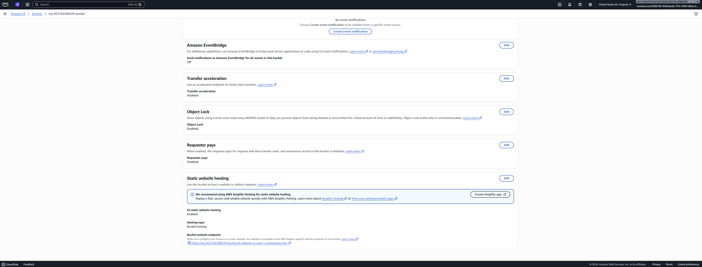
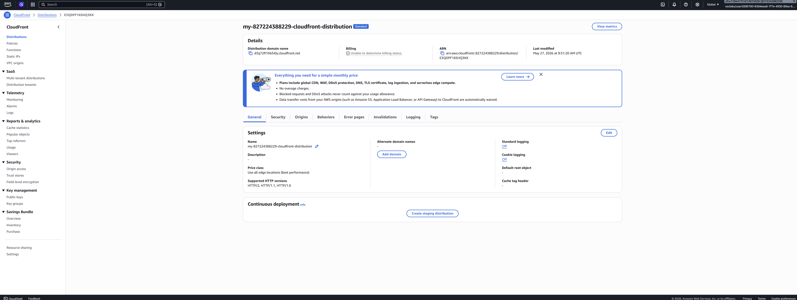
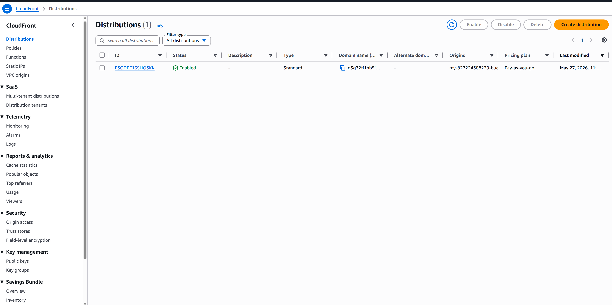

# Udacity Cloud Developer - Part 1

## URLs
- CloudFront: https://d3q72fi1hb5i0y.cloudfront.net/#
- S3 website: http://my-827224388229-bucket.s3-website-us-east-1.amazonaws.com/
- S3 object URL: https://my-827224388229-bucket.s3.us-east-1.amazonaws.com/index.html

## Created Resources
I created and configured the following resources for this project.

### 1. S3 bucket with files
Uploaded project files to the S3 bucket.

### 2. S3 bucket policy
Configured the bucket policy to allow public read access for static website hosting.

### 3. S3 static website hosting
Enabled static website hosting for the S3 bucket.

### 4. CloudFront distribution
Created a CloudFront distribution in front of the S3 origin.

